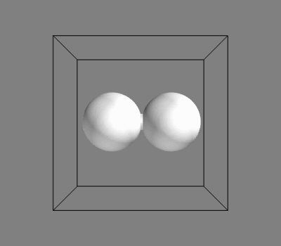

# D Lattice Boltzmann Code
 

DLBC is a fully paralellized implementation of the [lattice Boltzmann method](http://en.wikipedia.org/wiki/Lattice_Boltzmann_methods) for simulating fluid dynamics, using the [D programming language](http://dlang.org/). The goal is to prove the suitability of the D programming language for scientific computing / HPC and provide a well-tested and well-documented benchmark code, which will also perform well.

## Features

- Generic code that can use D3Q19, D2Q9, D1Q5 or D1Q3 lattices, speficied at compile time (other connectivities can be easily added when required).
- Fluid multicomponent model by Shan and Chen, supporting an arbitrary number of fluids.
- Static geometries with bounce-back boundary conditions.
- Fully parallelized code using [MPI](http://en.wikipedia.org/wiki/Message_Passing_Interface).
- Ability to write checkpoints to allow to split up long simulations into short runs.
- Code quality safeguards:
  - Continuous integration testing using [Travis CI](https://travis-ci.org/SFrijters/DLBC).
  - Code coverage analysis using [Coveralls.io](https://coveralls.io/r/SFrijters/DLBC).

## Requirements

An example of an installation can be found in the [Travis CI file](.travis.yml). This does not include plotting / rendering / documentation requirements.

### Basic requirements

**DMD**:   

**LDC**:  

**GDC**:  

- The code has been tested on Linux only; it may work on other systems as well, but this has never been tried.
- To build the code a D compiler is required (obviously). In particular, because of the use of the new multidimensional array syntax, a frontend version v2.066.0 or later is required. The code currently compiles with DMD, as well as GDC and LDC2. GDC currently achieves the best performance.
- The use of [DUB](http://code.dlang.org/download) as an installer is recommended (and is required for testing).
- To run the simulation code, the [MPICH 3.1](http://www.mpich.org/) and [HDF5 1.8.13](http://www.hdfgroup.org/HDF5/) libraries are required.

### Additional requirements

- To run the tests, python and the HDF5 binaries are also required (in particular h5diff).
- To create the test result plots matplotlib, h5py and numpy/scipy are required.
- To create PDF documentation, LaTeX is required.
- To render the data, mayavi is required.

### Submodules

D HDF5 bindings have been added as a submodule [hdf5-d](http://github.com/SFrijters/hdf5-d). This is a work in progess but does the job for now.

D MPI bindings are also still a work in progress and are currently handled through a partial header translation [`mpi.d`](src/dlbc/mpi.d) in this repository, which only includes MPI functions that are actually required by this code.

Multidimensional arrays have been added using a fork of Denis Shelomovskij's [Unstandard library](https://bitbucket.org/SFrijters/unstandard). Compared to upstream, some modules that are not used by DLBC have been removed, and support for addressing the array by a fixed-length array have been added.

Documentation is generated using DDoc and Jakob Ovrum's [bootDoc](http://github.com/JakobOvrum/bootDoc).

### Code quality

Continuous integration testing using [Travis CI](https://travis-ci.org/SFrijters/DLBC) is achieved by a small custom Python framework with a JSON test specification. PDF documentation on the testing framework can be generated:

    cd tests/runnable/doc ; make

Code coverage analysis is built into the DMD compiler. The Python testing framework is used to merge coverage information from unittests and runnable tests into a single set of files. The data is then sent to [Coveralls.io](https://coveralls.io/r/SFrijters/DLBC) by [Doveralls](https://github.com/ColdenCullen/doveralls).

## Using the code

### Compilation

DLBC can be most easily compiled using [DUB](http://code.dlang.org/download).

    dub build -b release -c <configuration> --compiler <compiler>

where `<configuration>` specifies the lattice connectivity and is one of `d3q19` (default), `d2q9`, `d1q5` or `d1q3`, and `<compiler>` is usually one of `dmd`, `gdc`, or `ldc2`.

The Makefile currently forwards to DUB build instructions.

### Running a simulation

Calling the executable with `-h` will display a usage message. One will normally use

    mpirun -np <n> ./dlbc -v <verbosity> -p <parameters.in>

to run a basic simulation, where `<n>` is the number of processes MPI will use, `<verbosity>` specifies how much output is written to the console, and `<parameters.in>` is a path to a parameter file. Examples of these can be found in the [various tests](https://github.com/SFrijters/DLBC/search?utf8=%E2%9C%93&q=path%3Atests%2Frunnable+extension%3Ain&type=Code) below `tests/runnable`. Full documentation for all parameters can currently be found only in the code comments; creating a user pdf guide is a work in progress.

## Future improvements

- Improve test code coverage.
- Improve documentation (including pdf user guide).
- Validate electric charge extension.
- Performance improvements.

## Pull requests

Are welcomed!

## License

The simulation code is made available under the [GPL-3.0 license](http://www.gnu.org/licenses/gpl-3.0.txt). The submodules are subject to their own licenses.

